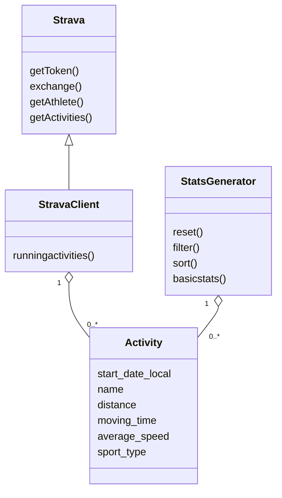

# stravastats

Henter data fra Strava og viser statistiske nøgletal

```mermaid
    classDiagram
        Strava <|-- StravaClient
        StravaClient "1" o-- "0..*" Activity 
        StatsGenerator "1" o-- "0..*"  Activity

    Activity: start_date_local
    Activity: name 
    Activity: distance  
    Activity: moving_time
    Activity: average_speed
    Activity: sport_type 
    
    Strava : getToken()
    Strava : exchange()
    Strava : getAthlete()
    Strava : getActivities()

    StravaClient : runningactivities()

    StatsGenerator : reset()
    StatsGenerator : filter()
    StatsGenerator : sort()
    StatsGenerator : basicstats()
```

